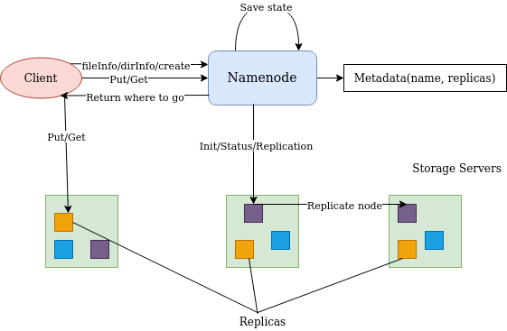
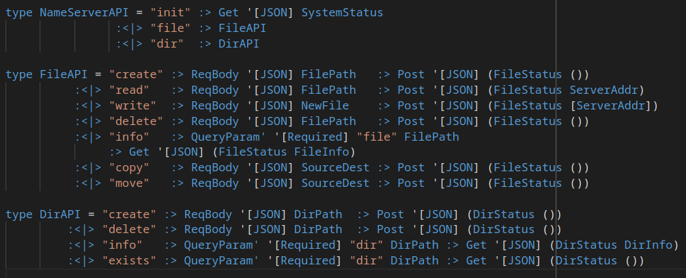
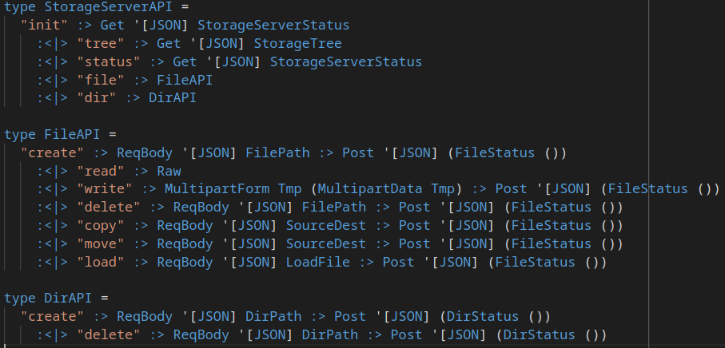

# Distributed Systems
## Group Project 2: Distributed File System

### Team monadfs

Pure functional distributed file system build on Haskell.

#### Team members:
* Mihail Kuskov [m.kuskov@innopolis.university](m.kuskov@innopolis.university) 
* Alfiya Mussabekova [a.mussabekova@innopolis.university](a.mussabekova@innopolis.university)
* Nikita Aleshenko [n.aleschenko@innopolis.university](n.aleschenko@innopolis.university)

#### Link to [Github repository](https://github.com/Dantara/monadfs) 

#### Contents:
0. [Description of the task](#description)
1. [The goal of the assignment](#goal)
2. [Prerequisites](#prerequisites)
3. [Build & Run](#build)
4. [Implementation details](#implementation)
5. [File structure](#structure)
6. [Member contribution](#contribution)
7. [Conclusion](#conclusion)
8. [References](#refer)
9. [Useful links](#links)

### __Description of the task__ <a name="description"></a>
According to [project description](https://docs.google.com/document/d/1Is2QFO20RjxVrZMSMCxsBa-FUgGgaIJ7e_o3CeQKN6w/edit#heading=h.3457zhh89myt), the task is to implement a simple <i>Distributed File System</i>, which will be able to support basic operations like file reading, deleting, writing, creating and etc. The main components of DFS are: <i>Name server</i>, <i>Storage servers</i>, <i>Client</i>. Clients access storage servers in order to read and write files. Storage servers must respond to certain commands from the naming server.

### __The goal of the assignment__ <a name="goal"></a>

1. Understand the roles of namenode, storages and client, distribute functionallity
2. Go deep into haskell language libraries
3. Write compiled and working web server
4. Deploy servers on [AWS](https://aws.amazon.com/) using [docker](https://www.docker.com/)

### __Prerequisites__ <a name="prerequisites"></a>

This project relies on the [Haskell Stack tool](https://docs.haskellstack.org/en/stable/README/).

It is recommended to get Stack with batteries included by
installing [Haskell Platform](https://www.haskell.org/platform/).

### __Build__ <a name="build"></a>

To build this project simply run

```sh
stack build
```

This will install all dependencies, including a proper version of GHC

### __Run__

This app consist of multiple executable. 
You can run each one independently.

To start the client, run the following command:

``` 
stack exec monadfs-client
```

To start the name server, run the following command:

``` 
stack exec monadfs-name-server
```

To start the storage server, run the following command:

``` 
stack exec monadfs-storage-server
```

### __Implementation details__ <a name="implemantation"></a>
Project has the following structure:

We have one _namenode_ which keeps metadata and controls storage services. In _docker-compose.yml_ we can define the number of _storage services_, which is 3 by default. _Storage server_ is the data store which provides _client_ with access to data files. Whenever a _client_ executes some command, it connects to _name server_, which either executes this command (_dirInfo_, _fileInfo_, _create_) or finds where needed data resides and returns address to _client_, which in its turn connects to _storage server_ and executes the command (_get_, _put_).

API for _name server_:

API for _storage server_:


### __File Structure__ <a name="structure"></a>

Here you can see simplified file structure of a project:

```
.
├── client
│   └── Main.hs
├── name-server
│   └── Main.hs
├── shared
│   ├── API
│   │   ├── NameServer.hs
│   │   └── StorageServer.hs
│   ├── API.hs
│   └── Lib.hs
├── storage-server
│   └── Main.hs
└── test
    └── Spec.hs

```

- Folders `client`, `name-server`, `storage-server` contain code required only for the client, the name server and for the storage server respectively.
- Folder `shared` contains code which can be imported to every executable.
- Folder `test` constains tests for a code.

### __Member contribution__ <a name="contribution"></a>
**Mihail Kuskov**
* Client server
* Storage server
* Report 

**Alfiya Mussabekova**
* Report
* Project deployment on [AWS](https://aws.amazon.com/)
* Docker containeranization
* Client server

**Nikita Aleschenko**
* Name server
* Project deployment on [AWS](https://aws.amazon.com/)
* Report

### __Conclusion__ <a name="conclusion"></a>
The stated goals were achieved, one of the difficulties that we met during the project is parsing of _relative_ and _absolute_ file _paths_ in console client commands. 

Another one is that sometimes because of luck of time we made design decisions which allowed us to code faster, but now they are harder to understand and maintain. For example, error massages in our implementation are not handled in fancy way, we just directly forward them to user. 

The difficulties also appeared in docker deployment part, because in order to build and compile haskell project we need <i>stack</i> (a cross-platform program for developing haskell projects), which image is about 11GB. Therefore, we needed to have 2 stage _Dockerfile_ in order to make docker images with components of _DFS_ light.

What was good?
* Purely functional
* Strong type system
* Team organization

What could be improved?
* Time management
* Implement _change dir_ on namenode

### __References__ <a name="refer"></a>

* Link to [Github repository](https://github.com/Dantara/monadfs) 
* Link to [Project description](https://docs.google.com/document/d/1Is2QFO20RjxVrZMSMCxsBa-FUgGgaIJ7e_o3CeQKN6w/edit#heading=h.3457zhh89myt) 
* Link to [Presentation](https://docs.google.com/presentation/d/1y2G5OnczA4IQZ5S3T3t084YfqONjYGTgAWwkBjiDmbk/edit?usp=sharing)
* Link to docker image for [name server](https://hub.docker.com/repository/docker/krokodilchk/dfs-namenode)
* Link to docker image for [storage server](https://hub.docker.com/repository/docker/krokodilchk/dfs-storage)
* Link to docker image for [client](https://hub.docker.com/repository/docker/krokodilchk/dfs-client)

### __Useful Links__ <a name="links"></a>
* [Haskell Stack tool](https://docs.haskellstack.org/en/stable/README/)
* [Haskell Platform](https://www.haskell.org/platform/)
* [directory-tree](https://hackage.haskell.org/package/directory-tree)
* [MultipartData](https://docs.servant.dev/en/stable/cookbook/file-upload/FileUpload.html)
* [disk-free-space](https://hackage.haskell.org/package/disk-free-space)
* [Parsing command line](https://hackage.haskell.org/package/optparse-applicative)
* [servant](https://docs.servant.dev/en/stable/tutorial/Server.html)
* [servant-server](https://hackage.haskell.org/package/servant-server)
* [servant-client](https://hackage.haskell.org/package/servant-client)
* [aeson](https://hackage.haskell.org/package/aeson)
* [bytestring](https://hackage.haskell.org/package/bytestring)
* [cryptonite](https://hackage.haskell.org/package/cryptonite)
* [splitmix](https://hackage.haskell.org/package/splitmix)
* [haskeline](https://hackage.haskell.org/package/haskeline)